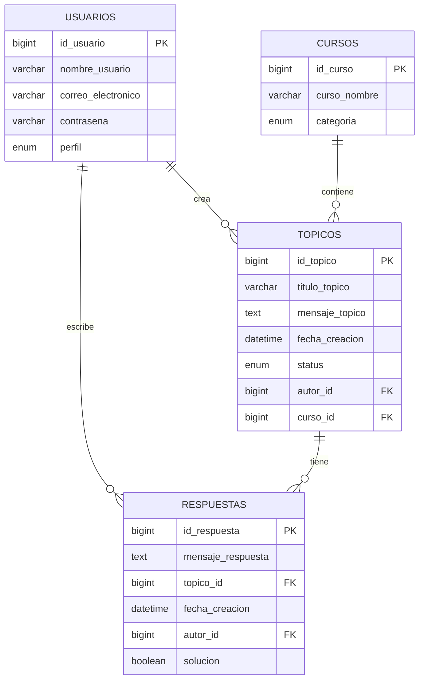

# ForoHub 🎓


ForoHub es una aplicación de foros en línea desarrollada en Java 17 con Spring Boot 3, Spring Security 6.1 y MySQL. Permite a los usuarios interactuar mediante la creación y gestión de cursos, tópicos y respuestas, asegurando un entorno seguro mediante autenticación y autorización basada en JWT.

## 📑 Tabla de Contenidos
- [Requisitos](#-requisitos-previos)
- [Configuración](#-configuración-inicial)
- [Flujo de la aplicación](#-flujo-de-la-aplicación)
- [Seguridad](#-seguridad)
- [API Endpoints](#-api-endpoints)
- [Modelo de datos](#-modelo-de-datos)
- [Contribución](#-contribución)

## ⚙️ Requisitos previos

Antes de ejecutar el proyecto, asegúrate de tener instalados:
- **Java 17**
- **MySQL**
- **Maven**

## 🚀 Configuración inicial

### 1️⃣ Configurar Base de Datos
```properties
# application.properties
spring.datasource.url=jdbc:mysql://localhost/forohub_api
spring.datasource.username=root
spring.datasource.password=tu_contrasena
spring.jpa.hibernate.ddl-auto=update
spring.jpa.show-sql=true
```

### 2️⃣ Estructura de la Base de Datos
```sql
-- Creación de tablas
CREATE TABLE usuarios (
    id_usuario BIGINT AUTO_INCREMENT PRIMARY KEY,
    nombre_usuario VARCHAR(100) NOT NULL,
    correo_electronico VARCHAR(150) NOT NULL UNIQUE,
    contrasena VARCHAR(255) NOT NULL,
    perfil ENUM('PROFESOR', 'ALUMNO', 'ADMINISTRACION') NOT NULL
);

CREATE TABLE cursos (
    id_curso BIGINT AUTO_INCREMENT PRIMARY KEY,
    curso_nombre VARCHAR(100) NOT NULL,
    categoria ENUM('PROGRAMACION', 'MATEMATICAS', 'CIENCIAS', 'HISTORIA') NOT NULL
);

CREATE TABLE topicos (
    id_topico BIGINT AUTO_INCREMENT PRIMARY KEY,
    titulo_topico VARCHAR(200) NOT NULL,
    mensaje_topico TEXT NOT NULL,
    fecha_creacion DATETIME NOT NULL DEFAULT CURRENT_TIMESTAMP,
    status ENUM('ABIERTO', 'CERRADO', 'RESUELTO', 'PENDIENTE') NOT NULL,
    autor_id BIGINT NOT NULL,
    curso_id BIGINT NOT NULL,
    FOREIGN KEY (autor_id) REFERENCES usuarios(id_usuario),
    FOREIGN KEY (curso_id) REFERENCES cursos(id_curso)
);

CREATE TABLE respuestas (
    id_respuesta BIGINT AUTO_INCREMENT PRIMARY KEY,
    mensaje_respuesta TEXT NOT NULL,
    topico_id BIGINT NOT NULL,
    fecha_creacion DATETIME NOT NULL DEFAULT CURRENT_TIMESTAMP,
    autor_id BIGINT NOT NULL,
    solucion BOOLEAN NOT NULL DEFAULT FALSE,
    FOREIGN KEY (topico_id) REFERENCES topicos(id_topico),
    FOREIGN KEY (autor_id) REFERENCES usuarios(id_usuario)
);
```

### 3️⃣ Ejecutar el proyecto
```bash
# Instalar dependencias
mvn clean install

# Iniciar la aplicación
mvn spring-boot:run
```

> 📝 La aplicación estará disponible en: `http://localhost:8080/api`

## 🔄 Flujo de la aplicación

### 🔐 Autenticación y Autorización

El sistema implementa un robusto mecanismo de seguridad basado en JWT:

- **Proceso de Login:**
    - Endpoint: `POST /login`
    - Valida credenciales usando `DtoLogin`
    - Genera token JWT con `TokenServis`
    - Implementa filtros de seguridad con `SecurityFilter`

### 👥 Gestión de Usuarios

El módulo de usuarios maneja el registro y autenticación:

```java
@Email
@Column(name="correo_electronico", nullable=false, unique=true)
private String correoElectronico;
```

### 📚 Gestión de Cursos

Administración de cursos con validaciones:

```java
if (cursoRepository.existsByNombre(cursoDTO.nombre())) {
    throw new ValidacionException("Ya existe un curso con el nombre: " + cursoDTO.nombre());
}
```

### 📝 Gestión de Tópicos

Sistema de manejo de tópicos con estados y validaciones:

```java
@PrePersist
protected void onCreate() {
    this.fechaCreacion = LocalDateTime.now();
}
```

## 🔒 Seguridad

### JWT Implementation
- Generación de tokens seguros
- Validación en cada request
- Encriptación BCrypt para contraseñas

### CORS Configuration
```java
@Configuration
public class WebConfig implements WebMvcConfigurer {
    @Override
    public void addCorsMappings(CorsRegistry registry) {
        registry.addMapping("/**")
                .allowedOrigins("*")
                .allowedMethods("*");
    }
}
```

## 🔌 API Endpoints

| Método | Endpoint | Descripción |
|--------|----------|-------------|
| POST | `/login` | Autenticación de usuarios |
| POST | `/signup` | Registro de nuevos usuarios |
| GET | `/cursos` | Listar todos los cursos |
| POST | `/cursos` | Crear nuevo curso |
| GET | `/topico` | Listar tópicos |
| POST | `/topico` | Crear nuevo tópico |
| PUT | `/topico/{id}` | Actualizar tópico |
| DELETE | `/topico/{id}` | Eliminar tópico |
| POST | `/respuestas` | Crear nueva respuesta |
| GET | `/respuestas/{id}` | Obtener respuestas de un tópico |

### 📦 Ejemplos de Respuestas

#### ✅ Respuesta exitosa
```json
{
    "mensaje": "Operación realizada con éxito",
    "detalles": {
        "id": 123,
        "titulo": "Nuevo tópico registrado"
    }
}
```

#### ❌ Respuesta de error
```json
{
    "error": "Error de validación",
    "detalles": "Ya existe un tópico con el título especificado"
}
```

## 📊 Modelo de datos




## 🤝 Contribución

1. Haz un Fork del proyecto
2. Crea una rama para tu feature (`git checkout -b feature/AmazingFeature`)
3. Commit tus cambios (`git commit -m 'Add some AmazingFeature'`)
4. Push a la rama (`git push origin feature/AmazingFeature`)
5. Abre un Pull Request

## 🎥 Demostración de Endpoints

### Registro, Login, Consultas http de Cursos y Topico 
### Parte 1: Crear un usuario, loguearse y CRUD Cursos 
1. (https://youtu.be/yGTQylf96Q4)
- [Ver Video](https://youtu.be/yGTQylf96Q4)

### Parte 2: Primera parte de Creación de un topico y consultas
2. (https://youtu.be/ur26P1oL0pc)
- [Ver Video](https://youtu.be/ur26P1oL0pc)

### Parte 3: Segunda parte de consultas a Topico
3. (https://youtu.be/RcHmb-DZRj4)
  - [Ver Video](https://youtu.be/RcHmb-DZRj4)

## 📝 Licencia

Este proyecto está bajo la licencia MIT - ver el archivo [LICENSE.md](LICENSE.md) para más detalles.


